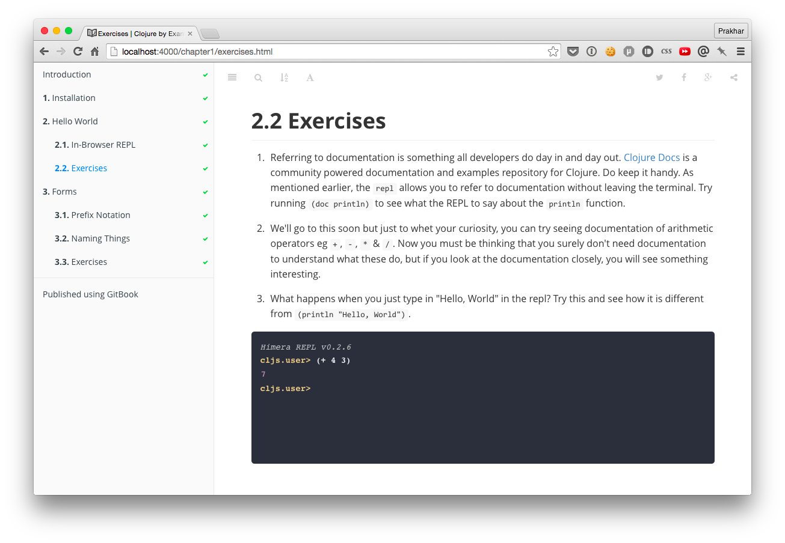

Clojure REPL - GitBook Plugin
==============

This is a Gitbook Plugin that allows you to embed a Clojure REPL right in your Gitbook!



The plugin stands on the shoulders of two awesome open-source projects - 

- [jqConsole](https://github.com/replit/jq-console): A jquery plugin for embedding a terminal
- [TryClojure](http://www.tryclj.com/): The backend app powering the REPL.

### Dependancies
To make this work, you need a running Clojure app in the backend to which the REPL will send code via Ajax and get back evaluated result. 

To make this easy, just fork the [Try Clojure](https://github.com/Raynes/tryclojure) project and host it on Heroku. The plugin can then be customized to use your custom heroku app. 

Note: You will need to customize the Try Clojure noir app so that it can accept cross-domain requests.

### Usage
```
{ "plugins": ["clojurescript"] }
```
